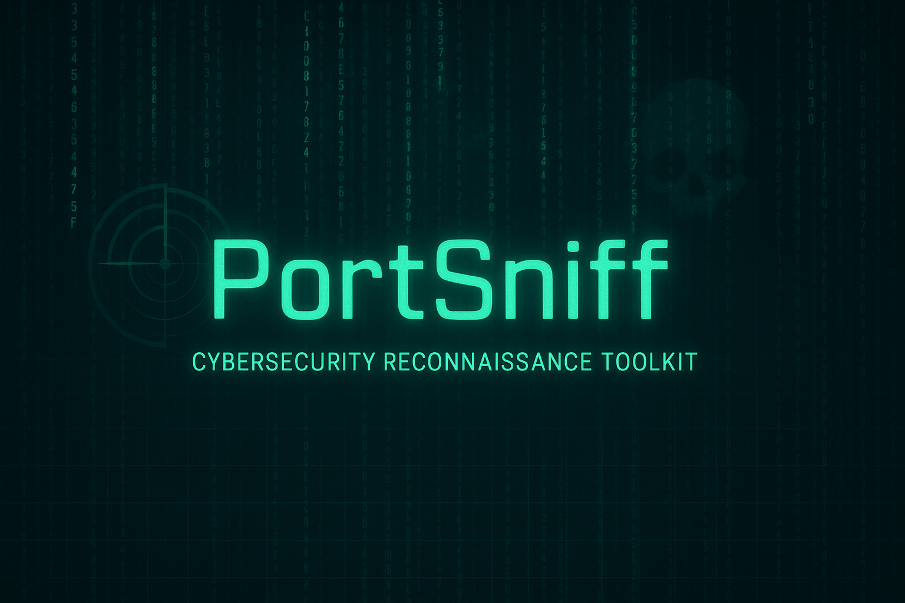

# 🚀 PortSniff — Cybersecurity Reconnaissance Toolkit

> “First, we recon. Then, we exploit.”  
> — A Cybersec Operator's Mantra 🧠💻

---

 

**PortSniff** is a full-fledged GUI-based **Reconnaissance Tool** for cybersecurity professionals, ethical hackers, and curious learners.  
From **Port Scanning** to **OS Detection**, PortSniff helps you uncover what’s running behind the IP curtain — just like the pros do.

---

## 🎯 Features

🛰️ **Unified GUI Interface**  
Built with `ttkbootstrap` — intuitive, dark-themed, tabbed design that’s smooth and powerful.

🔍 **Port Scanning Techniques**
- **TCP Connect Scan** 🔌
- **SYN Scan** 🧿 (Half-open stealth scan)
- **Slow Scan (Evasion)** 🐢
- **Decoy Scan (Anti-trace)** 🕵️‍♂️

🪪 **Banner Grabbing**
- Grab banners via **TCP**, **HTTP**, **Fragmented**, and **Proxy-based** methods.
- Designed to mimic Nmap’s output layout for a professional feel.

🧠 **OS & Version Detection**
- Active fingerprinting + Passive detection
- Simulated stack responses for intelligent OS guesses

⚙️ **Command-Line Mode**
- Full CLI integration with `argparse` for automation/scripting.

📦 **Standalone Executable**
- Built with PyInstaller for easy deployment — no Python required.

🎨 **Enhanced Output Logs**
- Color-coded logs
- Real-time updates
- Structured summaries (just like Nmap)

---

## 🧪 Modules Overview

### 1️⃣ Port Scanning
     Supports stealth, evasion, and aggressive modes.

python portmain.py tcp 192.168.1.1 -p 20-80 --threads 10

    2️⃣ Banner Grabbing
     Identify software/services behind open ports.

python main.py http 192.168.1.1 -p 80,443
 
    3️⃣ OS & Version Detection
     Fingerprint the operating system like a hacker.
  
python osv_main.py active 192.168.1.1

🖥️ GUI Usage
To launch the GUI:

       python homemain.py
                      
                      Or run the Windows executable:

.\dist\homemain\homemain.exe

You’ll get a tabbed interface with:

Home tab (Ascii banner + features)

Port Scanning tab

Banner Grabbing tab

OS & Version Detection tab

💡 Real-World Use Cases
✔️ Pre-engagement recon in penetration testing

✔️ Internal network assessments

✔️ Learning tool for  beginners 

REQURIMENTS ::

🛠️ Built With
🐍 Python 3.12+
🖼️ Tkinter + ttkbootstrap
🌈 Colorama
🔗 Sockets, Raw packets, Custom scanning logic
🧠 Multi-threading, Custom argparse, Socks proxy support

📁 Directory Structure

Portsniff/
│
├── homemain.py               # Launches full GUI
├── portsniff_GUI.py          # Central GUI logic (merged in homemain)
├── portscanning/             # Port scanning module (4 types)
│   ├── portmain.py
│   ├── Tcpconnectscanner_fixed.py
│   └── ...
│
├── BannerGrabbing/           # Banner grabbing module
│   ├── main.py
│   ├── banner_http.py
│   └── ...
│
├── Osversion/                # OS & version detection
│   ├── osv_main.py
│   └── ...
│
├── README.md                 # You're reading it now 👀
└── icon.ico                  # App icon

👨‍💻 Author ::

 CHARAN VOONNA 
  B.Tech CSE (Cybersecurity)
  Passionate about networks, security, and building real-world tools.

    “This is just the beginning.” — Charan

✅ Final Words
This project was built not in a day —
but over weeks of grinding, learning, debugging, crashing, and not giving up.

PortSniff is more than just a tool —
it’s a symbol that you can build anything you imagine if you refuse to quit. 💯

📸 Screenshot (Coming Soon)

📌 License
MIT License – Free to use, learn from, modify, and share.
Just don’t use it for illegal activities. Stay ethical. 🛡️

⭐ If you like this project, give it a star on GitHub. It helps more than you know.
